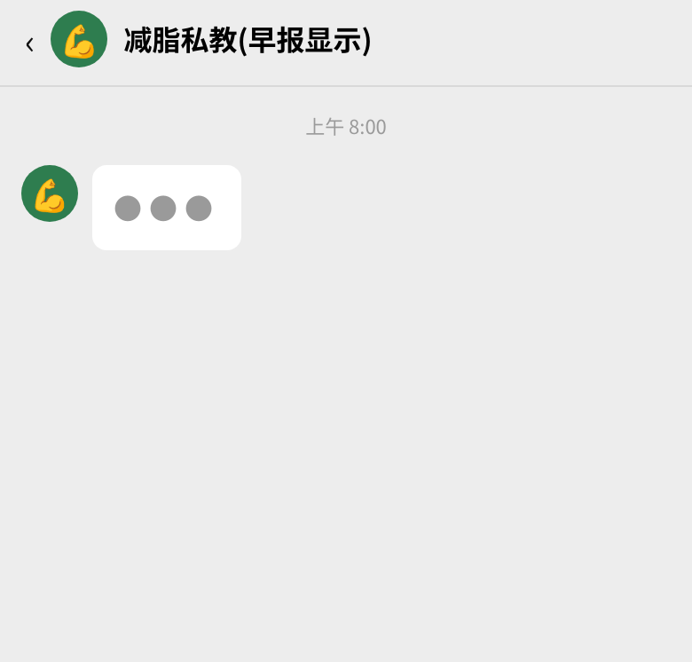
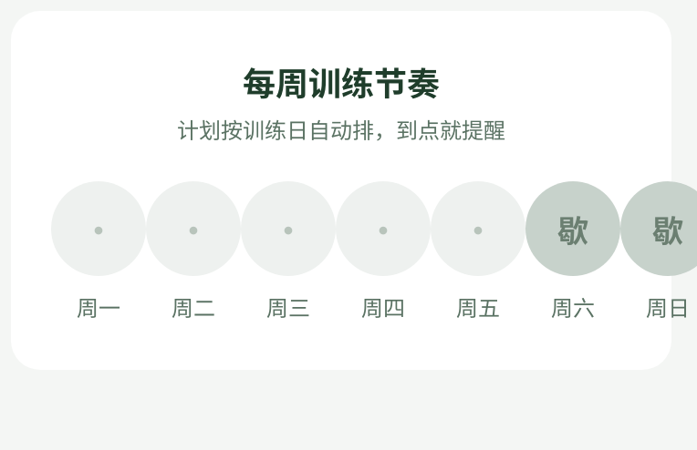
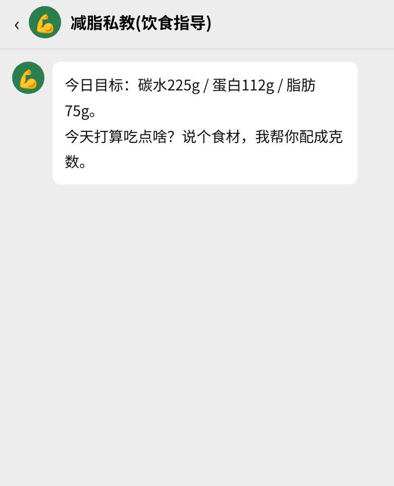
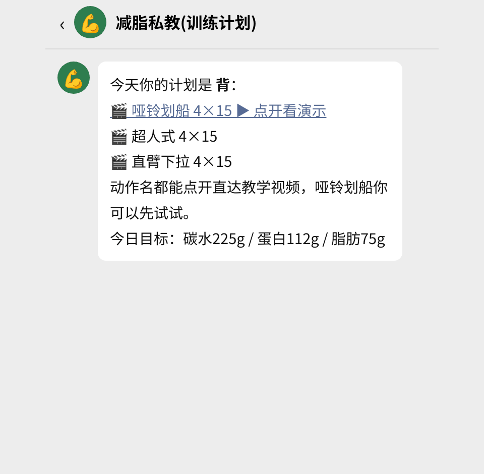
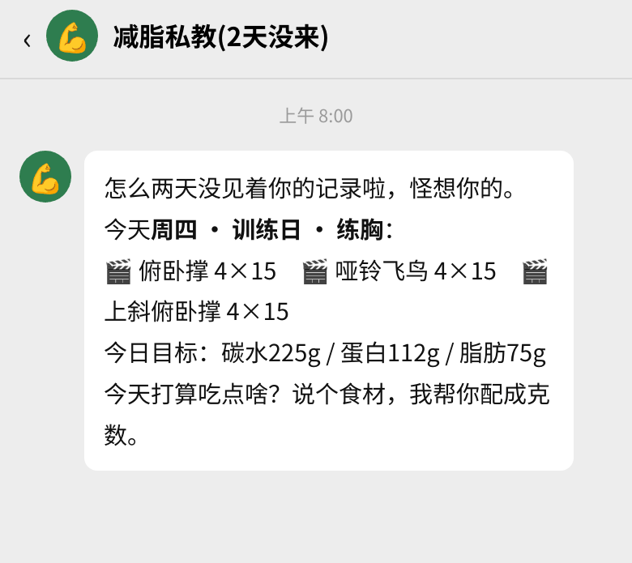

# 💪 home-fit-tracker · 居家减脂私教

**给想减脂、但只有客厅和一对哑铃的人。**

没有健身房卡、没有私教，照样系统训练：一个 AI 教练住在你的聊天软件里——每天早上告诉你今天练不练、吃什么、吃多少；训练计划按你的真实水平自动滚动；几天不来，它比你还着急。

## 它长什么样

### 🌅 每日早报



每天定时一条：今天练不练、动作和组数、当日营养素目标、称重提醒。**训练日和非训练日是两套话术**，数据全部发的时候现读表格——你进档了、营养素变了，早报自动跟着变。

### 📅 训练节奏



按你定的"每周练几天"自动排期：一周5练就排周一到周五，周末休息。恢复也是计划的一部分。

### 🍚 饮食建议



你说今天想吃什么，它按你当天的营养目标配成**每种食材的具体克数**。规矩只有一条：碳水/蛋白/脂肪逐项加总，对照目标 ±10g 以内才算配完，不许只报单样含量。

### 🏋️ 训练计划



居家自重 + 哑铃模板，一周 1~6 练全覆盖。**渐进超负荷自动滚动**：10次→12次→15次，到顶加重、次数回10重新爬。每个动作配人工核实过的 B站 教学链接，聊天里点动作名，直达教学演示。

### 💚 几天没来，有人惦记



连续 2~3 天没有任何记录，早报会说想你了；4 天以上，它先替你找原因、叮嘱照顾好身体——绝不指责、不下通牒，**计划照给，服务不降**。

## 数据长什么样

- `减脂数据/减脂追踪数据.xlsx`：训练记录 / 体重记录 / 饮食记录 / 用户档案，4 张子表
- `减脂数据/减脂追踪看板.html`：每次录入自动刷新的看板（档案卡、体重趋势、最近记录）；远程/IM 部署用 `view.py --shot` 截图直接发进聊天

## 安装到 ZCode

```bash
mkdir -p ~/.zcode/skills && cp -r home-fit-tracker ~/.zcode/skills/ && python3 -B ~/.zcode/skills/home-fit-tracker/scripts/profile.py get
```

输出 `profile: null` 即装好（首次运行自动建表，数据在 `~/减脂数据/`）。重开对话直接说"我想开始减脂"即可触发建档。

装到项目里（只在该项目用）：把 `home-fit-tracker` 复制到项目的 `.zcode/skills/` 下，数据落在项目根的 `减脂数据/`。

## 安装到其他 Agent（通用套路）

1. 把本目录交给 Agent，让它读 `SKILL.md` 并按其执行（SKILL.md 是行为指令，全部业务逻辑在 `scripts/`）
2. 依赖：Python 3.9+、openpyxl（缺了 `pip install openpyxl`）
3. 定时早报：只有平台有定时任务能力才能建（SKILL.md §5）；没有就跳过，其余功能不受影响

## 数据与隐私

- 数据全部在本地 `减脂数据/`，不经过任何第三方
- 重置：删除 `减脂数据/` 目录，下次运行自动重建空表（SKILL.md 规定 AI 必须二次确认后才执行）
- 升级：用新代码覆盖技能目录即可，数据在技能目录外不受影响

## 与 fat-loss-tracker（千问版）的关系

同源架构（薄 AI + 厚脚本），主要差异：

- 本地 xlsx 单后端（去掉飞书，所有 Agent 的通用分母）
- 训练模板改为居家版（自重 + 哑铃，1-6 练全覆盖）
- 动作教学视频链接内置（`EXERCISE_VIDEOS` 人工核实制，映射没有的不带、不编）
- HTML 看板：每次录入自动刷新，`--shot` 可截图发进聊天（file:// 链接跨设备点不开）
- 早报改为"brief.py 读表 + 自包含 prompt"：定时会话读不到聊天记录，一切以表格数据为准；缺勤分支由数据口径驱动

## 致谢

- 动作演示动图来自 [ExerciseDB](https://github.com/hasaneyldrm/exercises-dataset)（官方 CDN：static.exercisedb.dev），版权归其权利人所有，此处仅作演示引用
- 动作教学视频为 B站 公开视频，全部人工核实（快照见 `references/exercise_videos.md`）

## 许可证

[PolyForm Noncommercial 1.0.0](LICENSE)：个人和非商业用途免费使用、修改、分发；**商业用途需另行获得授权**。
